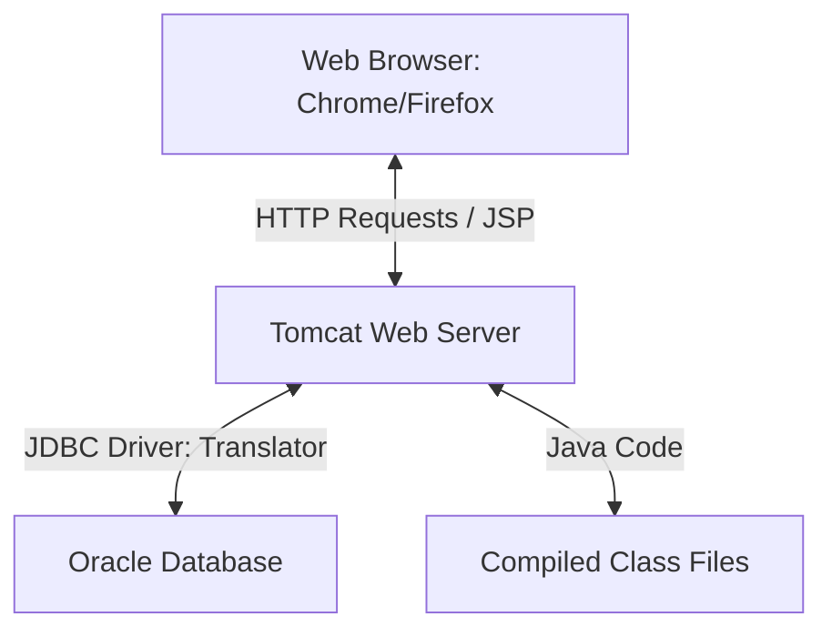

# HAL HR Seniority System - Comprehensive Offline Troubleshooting & Learning Guide

Welcome! This guide is written in simple, plain language to help you understand how the system works under the hood, how all the different pieces talk to each other, and how to fix **every possible problem** you might face on-site at HAL without internet access.

---

## Part 1: Learning the Basics (How the System Works)

To troubleshoot effectively, it helps to understand what each component does. Here is a simple breakdown:



### 1. The Web Browser (Chrome, Firefox, or Edge)
* **What it does**: It is the screen the user looks at. It sends requests (like "Show me Grade 10 Seniority") and displays the HTML/CSS web page.
* **Mockup Database (`localStorage`)**: In the offline mockup, the browser saves data inside its own memory partition called `localStorage`. If you refresh, the data stays. If you clear browser cookies/history or use a different browser, that mockup data is lost.

### 2. Apache Tomcat (The Web Server)
* **What it does**: Think of Tomcat as a waiter in a restaurant. When you (the browser) ask for a page (like `seniority.jsp`), Tomcat processes the request, talks to the chef (the Java code/database), and returns the cooked web page (HTML) back to your browser.
* **Where it runs**: It runs in the background on port `8080` (or another port you set).

### 3. Oracle Database (The Permanent Storage)
* **What it does**: A database is like an electronic filing cabinet. While Tomcat handles the web pages, Oracle permanently holds the rows of employee names, birthdates, and grade promotions.
* **How it connects**: It communicates over port `1521` (default for Oracle).

### 4. JDBC Driver (The Translator)
* **What it does**: Java code cannot speak directly to Oracle Database. They speak different languages. The JDBC Driver (the `.jar` file) acts as a translator. Without this file, Tomcat will throw a `ClassNotFoundException`.

### 5. Java Compiler (`javac`) vs. Java Runtime (`java`)
* **`javac` (Java Compiler)**: Translates human-readable `.java` files into machine-readable `.class` files. You need this to build the app when you modify code.
* **`java` (Java Runtime)**: Runs the compiled `.class` files. You only need this to execute the server.

---

## Part 2: Troubleshooting Guide (Every Possible Problem)

Here is a list of everything that could go wrong and exactly how to fix it:

### PROBLEM 1: Tomcat Port 8080 is already in use
* **What it means**: Another application is already using the network slot `8080` that Tomcat needs.
* **Symptom**: The console window flashes and closes immediately, or the log says: `Address already in use: bind`.
* **How to Fix (Option A: Kill the blocking process)**:
  - **On Windows**:
    1. Open command prompt (`cmd`) and run:
       ```cmd
       netstat -ano | findstr 8080
       ```
    2. Look at the number at the very end of the line (e.g. `4128`). This is the PID (Process ID).
    3. Force close it by running:
       ```cmd
       taskkill /F /PID 4128
       ```
  - **On Linux (Ubuntu)**:
    1. Open terminal and run:
       ```bash
       fuser -k 8080/tcp
       ```
* **How to Fix (Option B: Change Tomcat's Port)**:
  1. Open your project folder, go to **`tomcat\conf\`**, and open the file **`server.xml`** in Notepad.
  2. Search (`Ctrl + F`) for the number `8080`. You will find a line like:
     `<Connector port="8080" protocol="HTTP/1.1" ... />`
  3. Change `8080` to another number (like `8085` or `9090`).
  4. Save and close the file.
  5. Run the startup script. Your new URL will now be: `http://localhost:8085/HAL/`.

---

### PROBLEM 2: "Oracle JDBC Driver not found in classpath"
* **What it means**: Java cannot find the translator jar file (`ojdbc.jar`) to talk to Oracle.
* **Symptom**: The log says `ClassNotFoundException: oracle.jdbc.driver.OracleDriver`.
* **How to Fix**:
  1. Search for `ojdbc*.jar` on the HAL computer using Windows Explorer.
  2. Copy that file (e.g. `ojdbc14.jar` or `ojdbc6.jar`).
  3. Paste it directly into your project's **`tomcat\lib\`** folder.
  4. Stop the server (`shutdown.bat` or `shutdown.sh`) and start it again.

---

### PROBLEM 3: "Network Adapter could not establish the connection"
* **What it means**: Tomcat is running, but it cannot find the computer where Oracle Database is hosted.
* **Symptom**: The app runs but loads fallback dummy records because it cannot connect to the database.
* **How to Fix**:
  1. Open **`src\db.properties`** in Notepad.
  2. Check if `db.url` is correct. The format must be:
     `db.url=jdbc:oracle:thin:@IP_ADDRESS:PORT:SID`
     *(Example: `db.url=jdbc:oracle:thin:@10.20.30.40:1521:ORCL`)*
  3. Test if the database server is online by running this in terminal:
     `ping IP_ADDRESS`
     *(If ping fails, there is a network block or the server is turned off. Ask the HAL admin to check firewall ports for Port 1521).*

---

### PROBLEM 4: "Java Compiler (javac) not found"
* **What it means**: You have the Java Runtime (JRE) to run programs, but not the Developer Kit (JDK) which is required to compile Java source code.
* **Symptom**: The script prints `[WARNING] Java Compiler (javac) not found` and skips compilation.
* **How to Fix (Option A: Install JDK)**:
  - If offline, install the JDK installer from a USB drive (e.g., JDK 8 or OpenJDK 8).
  - Point the script to the compiler by opening **`start_hal_system.bat`** in Notepad and setting the path at the top:
    `set "JAVA_HOME=C:\Program Files\Java\jdk1.8.0"`
* **How to Fix (Option B: Use the Mockup Version)**:
  - If you cannot install JDK, open **`index.html`** directly in Chrome/Firefox. It runs entirely inside the browser and requires no compiler!

---

### PROBLEM 5: Changes in db.properties are not reflecting
* **What it means**: You modified table or column names in `src/db.properties` but the server still uses old ones.
* **Reason**: Tomcat reads properties from `tomcat/webapps/HAL/WEB-INF/classes/db.properties`, not your source directory.
* **How to Fix**:
  - Run the `start_hal_system.bat` (or `.sh`) script. It automatically copies configuration changes.
  - Or manually copy **`src/db.properties`** and paste it into **`tomcat\webapps\HAL\WEB-INF\classes\`** to overwrite, then restart Tomcat.

---

### PROBLEM 6: Mockup Portal shows old names (Browser caching)
* **What it means**: You updated names in `index.html`, but the browser still displays the old ones.
* **Reason**: The browser stores mockup data in its permanent `localStorage` cache.
* **How to Fix**:
  1. Open the page in your browser.
  2. Press **`F12`** on your keyboard to open Developer Tools.
  3. Click on the **Console** tab at the top.
  4. Type:
     ```javascript
     localStorage.clear();
     ```
     and press **Enter**.
  5. Refresh the page (`Ctrl + R`). The browser cache will be cleared and the new names will load.
  6. Alternatively, open the web browser in **Incognito / Private Window** mode.

---

### PROBLEM 7: Permission Denied on Linux (Ubuntu)
* **What it means**: Linux prevents you from executing the script because it does not have "execute permissions".
* **Symptom**: Running `./start_hal_system.sh` prints `Permission denied`.
* **How to Fix**:
  1. Open terminal and navigate to the project directory:
     ```bash
     cd "/path/to/HAL Internship"
     ```
  2. Grant execution permissions:
     ```bash
     chmod +x start_hal_system.sh
     chmod +x tomcat/bin/*.sh
     ```
  3. Run the script again:
     ```bash
     ./start_hal_system.sh
     ```

---

### PROBLEM 8: "ORA-28000: the account is locked"
* **What it means**: The database username has locked itself after too many failed password attempts.
* **Symptom**: Error logs show `java.sql.SQLException: ORA-28000: the account is locked`.
* **How to Fix**:
  1. Open **PL/SQL Developer** and log in as `SYSTEM` or another administrator account.
  2. Open a new SQL window and run this command:
     ```sql
     ALTER USER username ACCOUNT UNLOCK;
     ```
     *(Replace `username` with the locked username).*

---

### PROBLEM 9: "ORA-01861: literal does not match format string"
* **What it means**: The database is expecting date format in one way (like `DD-MON-YYYY`) but the SQL query is inserting it in another way (like `YYYY-MM-DD`).
* **Symptom**: Adding an employee throws date formatting errors.
* **How to Fix**:
  - Always use the `TO_DATE` function in SQL statements to tell Oracle exactly how to parse the date:
    ```sql
    TO_DATE('1990-08-25', 'YYYY-MM-DD')
    ```
  - Check the default format on the system by executing this in PL/SQL Developer:
    ```sql
    SELECT value FROM nls_session_parameters WHERE parameter = 'NLS_DATE_FORMAT';
    ```

---

### PROBLEM 10: Tomcat shutdown hangs (Process already running)
* **What it means**: You ran the shutdown script, but Tomcat is still running in the background and holding port 8080.
* **Symptom**: Trying to start the server again throws port-in-use errors.
* **How to Fix**:
  - **On Windows**: Open Task Manager (`Ctrl + Shift + Esc`), find the process named `Java(TM) Platform SE binary`, right-click and select **End Task**.
  - **On Linux**: Open terminal and run:
    ```bash
    killall -9 java
    ```

---

### PROBLEM 11: Other LAN computers cannot connect (Windows Firewall block)
* **What it means**: The portal works fine on the host machine (`http://localhost:8080/HAL/`), but other offline computers on the HAL local LAN cannot open the URL.
* **Symptom**: Browser shows `This site can’t be reached` or `Connection timed out` on other machines.
* **How to Fix**:
  1. Open Command Prompt as Administrator on the host machine.
  2. Run the following command to allow incoming connections on port `8080`:
     ```cmd
     netsh advfirewall firewall add rule name="Tomcat Web Server" dir=in action=allow protocol=TCP localport=8080
     ```
  3. Ensure both computers are connected to the same LAN subnet (e.g. `172.32.11.x`).

---

### PROBLEM 12: Tomcat starts but immediately shuts down (Port 8005 in use)
* **What it means**: The shutdown port `8005` (which Tomcat uses to listen for stop commands) is already occupied.
* **Symptom**: The console window starts, but Tomcat shuts down within a few seconds. The logs in `tomcat/logs/catalina.log` show: `Failed to create server shutdown socket on address [localhost] and port [8005] (Address already in use: JVM_Bind)`.
* **How to Fix**:
  - **On Windows**:
    1. Open command prompt (`cmd`) and run:
       ```cmd
       netstat -ano | findstr 8005
       ```
    2. Note the PID at the end of the line (e.g. `12450`).
    3. Run:
       ```cmd
       taskkill /F /PID 12450
       ```
  - **On Linux**: Run:
    ```bash
    fuser -k 8005/tcp
    ```

---

### PROBLEM 13: "ORA-12154: TNS:could not resolve the connect identifier"
* **What it means**: The client application (like PL/SQL Developer) or the JDBC connection cannot locate the database service name.
* **Symptom**: Connection fails with database identifier mapping errors.
* **How to Fix**:
  1. Locate the file named `tnsnames.ora` on the HAL machine (usually in `C:\oracle\product\...\client_1\network\admin\tnsnames.ora` or `network/admin/` folder under your Oracle Home).
  2. Open the file in Notepad and locate the connection block. For example:
     ```text
     HALDB =
       (DESCRIPTION =
         (ADDRESS_LIST =
           (ADDRESS = (PROTOCOL = TCP)(HOST = 172.32.11.10)(PORT = 1521))
         )
         (CONNECT_DATA =
           (SERVICE_NAME = HALPROD)
         )
       )
     ```
  3. Use the exact host (`172.32.11.10`), port (`1521`), and service name (`HALPROD`) details in your `src/db.properties` connection string:
     `db.url=jdbc:oracle:thin:@172.32.11.10:1521:HALPROD`

